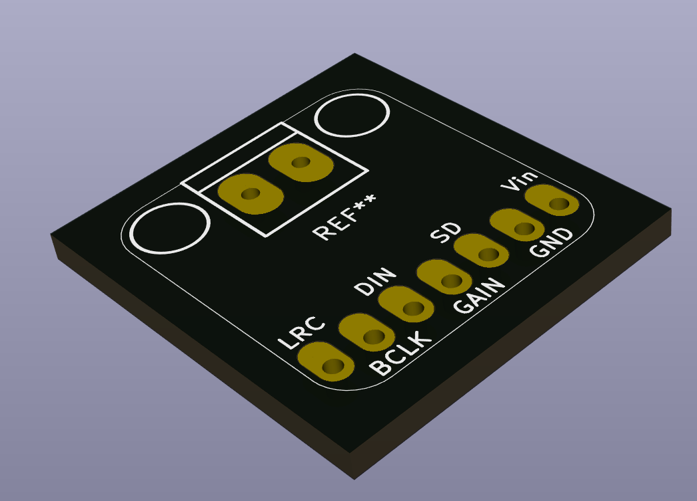
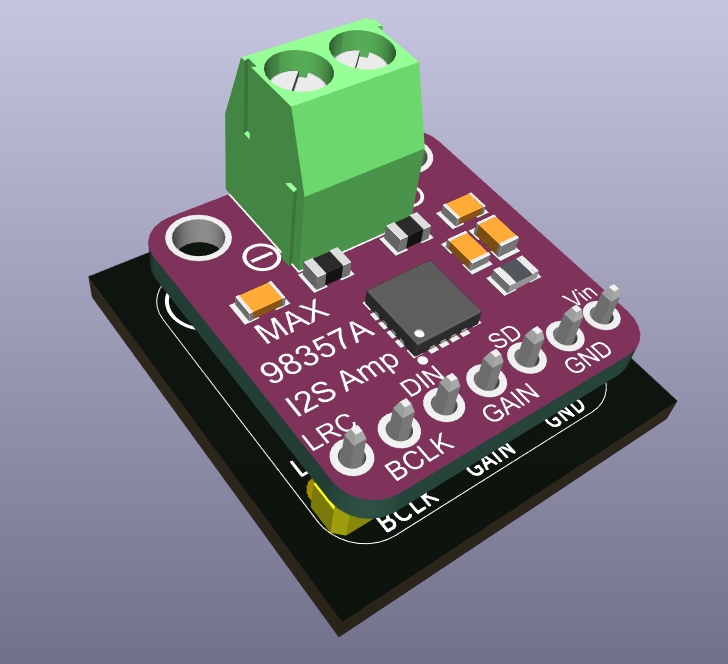

Adafruit MAX98357A i2s amp
==========================

This footprint allows to "grab" the audio output from the module and re-route it to another connector or an on-board speaker.

3D Model by [David Scambell](https://grabcad.com/library/max98357a-3w-i2s-amplifier-1)

## Installation

    git submodule add https://github.com/besi/kicad-adafruit-MAX98357 lib/adafruit-MAX98357
